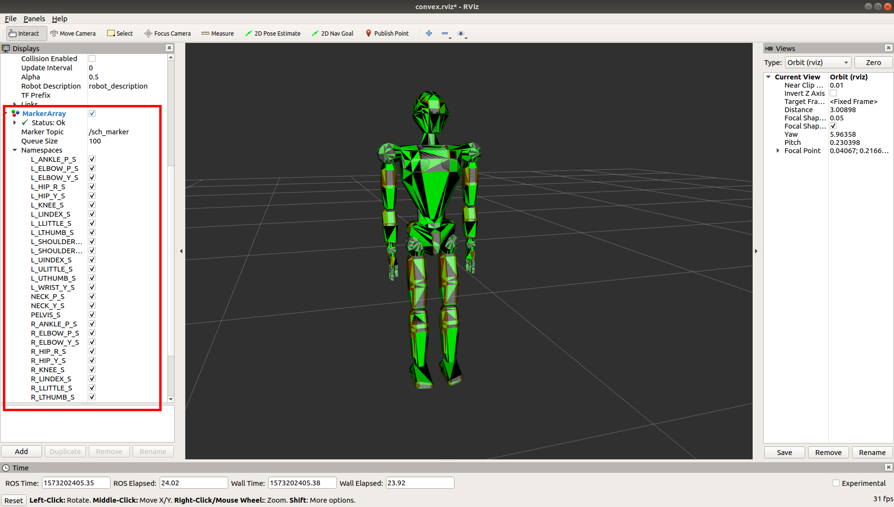

`mc_convex_visualization` is a tool that allows you to visualize the convexes of a robot in the RViZ application. It is part of the  package.

### Launching the visualization

The tool is launched as follows:

```bash
$ roslaunch mc_convex_visualization display.launch robot:=JVRC1
```

The `robot` argument should be the same as what you would pass to the `mc_rbdyn::RobotLoader::get_robot_module` function, this can also be a robot alias. For example:

```bash
# Specify a vector of arguments
$ roslaunch mc_convex_visualization display.launch robot:="[env, `rospack find mc_env_description`, ground]"
# Or an alias
$ roslaunch mc_convex_visualization display.launch robot:=env/ground
```

After launching it should look like this:



By enabling/disabling the checkboxes in the highlighted area you can show/hide selected convexes.
