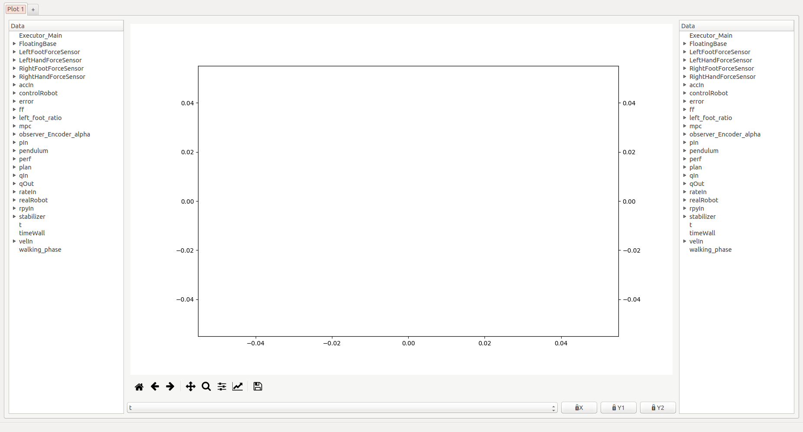

A simple GUI is provided in mc\_rtc to read the logs after an experiment
has been performed. This tool is installed as `mc_log_ui`

Provided you have obtained a log (e.g. `~/my_log.bin`) then you can open it in the GUI with:

```bash
$ mc_log_ui ~/my_log.bin
```

It should look like this:



<em>Note: some menus and operations described in the next sections are only available if you have mc\_rtc Python bindings</em>

### Plotting mode

The selector in the bottom left of the interface lets you select between three plotting modes:

#### Time plot

In this mode you select data that shares the same abscissa (generally time hence the name), the panels on the left and the right of the plot let you select which data to display. You can select a grouped entry (e.g. `LeftFootForceSensor`) or a single entry (e.g. `LeftFootForceSensor -> fz`).

Plots can be removed by clicking the same data entry again.

In this mode, selecting string entries (typically, the current state output of an FSM) will draw colored background patches according to the current value of said string. Only one string can be visible at a given time.

#### X/Y plot

In this mode, `Add XY plots` buttons on the left and right of the plot will open a menu to let you select two data entries that will be plotted on the X and Y axis respectively. You can select a grouped entry if it has exactly two entries (i.e. selecting `LeftFoot -> CoP` is the same as selecting `LeftFoot -> CoP -> x` and `LeftFoot -> CoP -> y` individually). A label can be set at this point or later in the sytle menu.

Plots can be removed by clicking the `Remove XY plot(s)` button on the left or right and selecting the plots to remove.

#### 3D plot

In this mode, an `Add 3D plot` button on the left will open a menu to let you select three data entries that will be plotted on the X, Y and Z axis respectively. You can select a grouped entry if it has exactly three entries (i.e. selecting `CoM` is the same as selecting `CoM -> x`, `CoM -> y` and `CoM -> z` individually). A label can be set at this point or later in the style menu.

Plots can be removed by clicking the `Remove 3D plot(s)` button and selecting the plots to remove.

You can use the mouse to manipulate the view in 3D mode.

### Time range selector, range making and axis lock

The selector under the plot lets you select the time range under which you wish to examine the log. In time plot mode, it simply selects the abscissa for the graph. In X/Y plot and 3D plot modes it will act as a filter (i.e. display the selected data when the selected range is active).

The `Make range` button lets you select arbitrary data to create time ranges when the data is in the log. For example, if `com_x` is present if `5 < t < 10` and `15 < t < 20` then it will generate `t_com_x_1` and `t_com_x_2` corresponding to these ranges. For strings (typically `Executor_*` from the FSM), the selection can be refined for specific values of the string (so you can typically generate ranges for specific states).

Finally, three buttons beside the `Make range` button let you lock the X axis, the left side Y axis and the right side Y axis (or Z axis in 3D mode) respectively. Otherwise, the limits adapt to the selected data. Note that the GUI will not try to align the left and the right side Y axes even when the ranges are similar.

### Animation

The three buttons below the range selector relate to the animation:

`Start animation` will start an animation based on the current time range selected. By default, the axes limits will adapt during the animation.

If the animation is not running, `Lock axes` will lock the axes so that the whole final graph in the animation is visible. Otherwise, it will lock the axes to the current view.

`Save animation` will export the animation to an mp4 file. Note that no progress bar appears and it could take a while to save the animation.

### Common plots menu

This menu contains a selection of common and useful plots for joint-level inputs/outputs and force sensors. When applicable, a second menu will let you select which joints to display, whether to display the appropriate limits and whether to generate one plot per joint.

### User plots menu

During the development of a controller you probably plot the same graph for different iterations of your controller. To save time, you can save your data selection. This is called a "User plot".

To create such a plot, you must setup the plot once manually. Then go the `User plots` menu and select `Save current plot`. You will be prompted for a name. This will then create a new entry in the `User plots` menu with this name.

After loading a new log, select this new entry in the `User plots` menu and it will redo the same selection and styling (it doesn't save axis limits or abscissa selection as they are likely to change).

Such plots are saved in a JSON format under `$HOME/.config/mc_log_ui/custom_plots.json`. This file can be stored in your controller repository to setup the log ui quickly on a new machine. It can also be passed to the `mc_plot_logs` tool (see below).

### Robot menu

This menu lets you select with which robot the log was generated. The main effect is to display user-friendly names in joint-related entries (e.g. instead of `qIn_0` you will get `qIn_R_HIP_P` with JVRC1 but `qIn_RLEG_JOINT0` with HRP2DRC.

The robot selection is saved upon change and restored when you open the UI again. Unless you work with a lot of robots it is likely you will change it once.

### Style menu

The style menu lets you set many styling options for your graph, it has several entries:

- `Graph`: lets you choose the line color and line style for each plot;
- `Grid`: lets you enable a grid aligned with the left and/or right axis;
- `Labels/Title/Fonts`: lets you add labels to the axes, a title to the graph and choose the police size for those;
- `Colors selection`: lets you choose which colors are picked to display curves, you can either choose an existing color set (which have a limited number of colors available) or build your own selection;
- `Polygons colors selection`: lets you choose the colors that are used when displaying string entries in time-plot mode;

_Note: style options are also saved when you save a user plot_

### Shortcuts

The following keyboard shortcuts can be used within the interface:

- `Ctrl+T`: create a new tab
- `Ctrl+W`: close the current tab
- `Ctrl+PageDown`: next tab
- `Ctrl+PageUp`: previous tab
- `Ctrl+A`: Axis limits menu

### Saving a figure

After choosing the fields you want and setting up the graph as you wish you can export by clicking the save button:


You can choose to save as a variety of formats. If you save to SVG (Scalable Vector Graphics) you can further edit the file in a vector graphics editor such as [Inkscape](https://inkscape.org).

### Automated figure plotting

The final tool introduced here is `mc_plot_logs`. It expects a binary log and a JSON file describing the logs that you wish to plot (the format is the same as user plots from `mc_log_ui`). It will output a figure for each plot in the provided file.

### Loading multiple logs

It might be desirable to load multiple logs at once for comparison purpose. This can be achieved by the following command:

```bash
$ mc_log_ui log-1.bin log-2.bin [...] log-N.bin
```

Or by loading the files through `File -> Compare...` in the menu.
