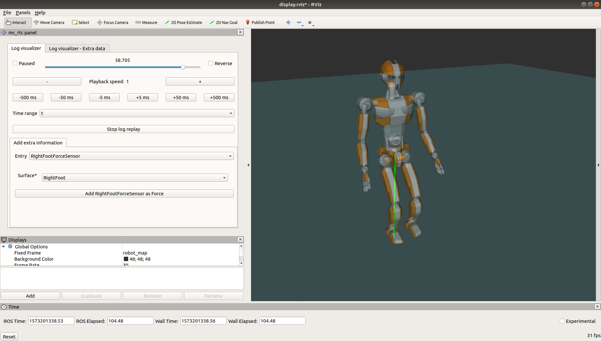

`mc_log_visualization` is a tool that allows you to visualize a log in 3D in the RViZ application. It is part of the  package.

### Launching the visualization

First you should launch the visualization interface, as you would when running a controller through the `mc_rtc_ticker`:

```bash
$ roslaunch mc_rtc_ticker control_display.launch robot:=jvrc1
```

Then you should launch the replay itself:

```bash
$ roslaunch mc_log_visualization log_visualizer.launch robot:=robot/jvrc1 log:=/tmp/mc-control-MyController-latest.bin
```

<em>Note: you <strong>must</strong> give a full path to the log here due to ROS limitations</em>

The interface should look like this:



#### Time range selector

This selector lets you select a time range for the visualization. Currently you should have saved this range in your log.

#### Add extra information

This menu lets you select extra information to display in the interface, based on the type of data was logged the tool will choose how to display the data.

In some cases, the UI will let you specify extra information before displaying the data. For example, in the screenshot, the `RightFootForceSensor` entry is selected so the UI will ask you in which surface frame the force should be displayed.

After adding extra information, it will be displayed in the 3D environment if applicable and the numeric data will be displayed in the `Log visualizer - Extra data` tab. In this tab, you can also remove the data from the visualization.

Extra data selection is saved across runs of the log visualizer.
