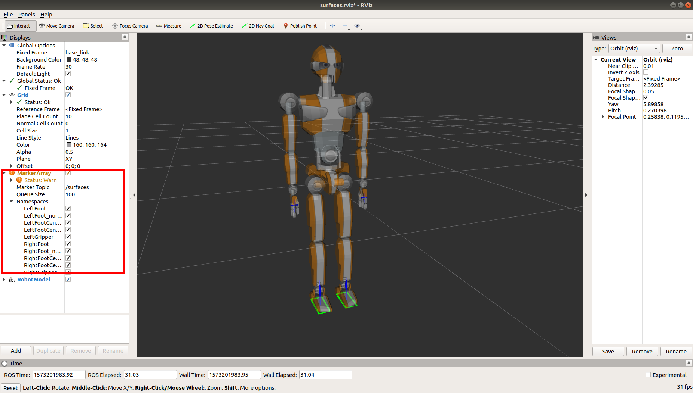

`mc_surfaces_visualization` is a tool that allows you to visualize the surfaces of a robot in the RViZ application. It is part of the  package.

### Launching the visualization

The tool is launched as follows:

```bash
$ roslaunch mc_surfaces_visualization display.launch robot:=robot/jvrc1
```

After launching it should look like this:



In the 3D display:

- Planar surfaces are drawn in green with a blue arrow showing the normal direction of the surface (as seen on the feet in the screenshot);
- Cylindrical surfaces are green cylinders (not seen in the screenshot);
- Gripper surfaces are represented with blue arrows representing the normal direction of the gripper's points' frame;

By enabling/disabling the checkboxes in the highlighted area you can show/hide selected surfaces.
